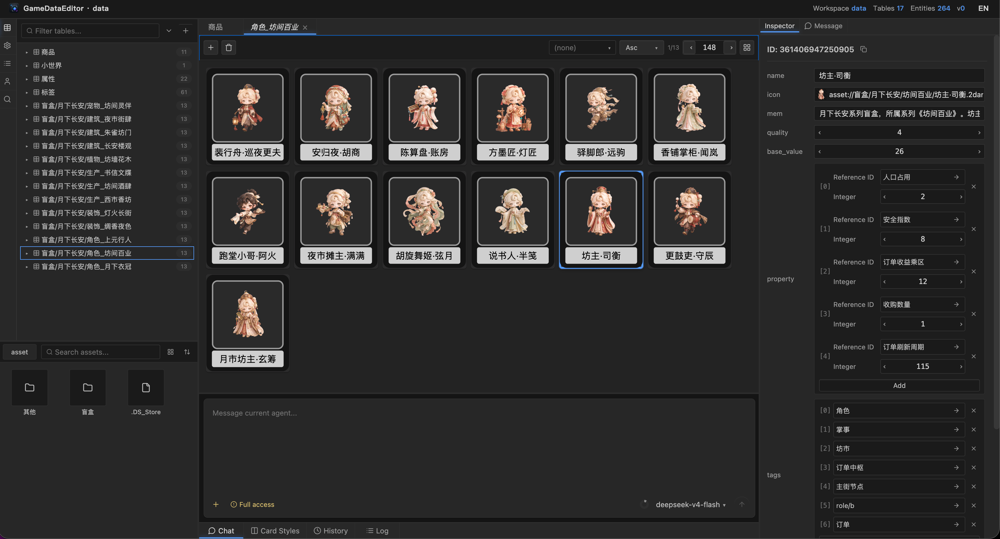

# GameDataEditor

GameDataEditor is a local-first editor for game data, content tables, and visual card previews. It is designed for game designers, technical designers, and content teams who need to manage structured game data without losing sight of how that data will look and behave in production.

The app runs as a static browser-based frontend. It organizes projects around table schemas, entity records, asset references, type configuration, and editable card layouts.



## Highlights

- **Table-based data editing**: Manage game entities as JSON tables with clear schema definitions and stable entity IDs.
- **Project-level type system**: Define reusable custom types, enums, ranges, asset fields, and compound data shapes in `gamedata.json`.
- **Asset references**: Link images, audio, and other files through the `asset://...` convention instead of hardcoding fragile local paths.
- **Card preview and layout editing**: Build visual card styles for each table so data can be reviewed in a form closer to its in-game presentation.
- **Editor-style workspace**: Work with docked panels for tables, type configuration, assets, inspectors, search, history, logs, and AI panels.
- **AI-ready context model**: Provide structured project, table, entity, field, asset, and card-style context to AI tools, then apply validated data patches.
- **No build step required**: The project can run directly in a modern browser.

## Quick Start

Clone the repository and open `index.html`:

```bash
git clone https://github.com/jinruozai/game-data-editor.git
cd game-data-editor
open index.html
```

If your browser restricts local file access, serve the directory with any static server:

```bash
python3 -m http.server 8080
```

Then open:

```text
http://localhost:8080
```

## Repository Layout

```text
.
├── index.html                 # Application entry point
├── logo.png                   # App icon
├── src/                       # Editor source code
│   ├── ai/                    # AI resources, tools, patch handling, and skills
│   ├── app/                   # App shell, layout bridge, toolbar, and app services
│   ├── cardstyle/             # Card style scene utilities and render adapters
│   ├── inspector/             # Inspector providers and field renderers
│   ├── panels/                # Dockable editor panels
│   ├── project-io/            # Project import/export and workspace IO
│   ├── typeconfig/            # Type configuration schema helpers
│   └── state.js               # Project data signals and domain commands
├── vendor/                    # Runtime frontend dependencies
├── docs/                      # Data format and AI integration documentation
├── skills/                    # Project-local AI skills
├── uploads/                   # Imported notes and sample configuration files
└── screenshots/               # Product screenshots
```

## Data Model

A GameDataEditor project is typically organized like this:

```text
project-root/
  gamedata.json
  asset/
  Characters.json
  Items.json
  Levels/Chapter1.json
```

Core conventions:

- `gamedata.json` stores project metadata, type configuration, and card styles.
- Every `.json` file outside `gamedata.json` and `asset/` is treated as a data table.
- Each table defines its schema under `_table.struct_def`.
- Entity IDs are stored as JSON object keys and should be globally unique across the project.
- Assets should be referenced with `asset://path/to/file`.

See [docs/data-format.md](docs/data-format.md) for the full format contract.

## AI Integration

GameDataEditor includes an AI adapter design for structured data editing. The goal is to give AI tools precise editor context instead of raw copied page text.

The AI context model covers:

- Project summaries
- Type configuration
- Tables and schemas
- Entities and selected fields
- Asset references
- Card style trees and bindings
- Validated patch application

Related documentation:

- [docs/ai-system-design.md](docs/ai-system-design.md)
- [docs/ai-interface-contract.md](docs/ai-interface-contract.md)
- [docs/ai-integration-targets.md](docs/ai-integration-targets.md)

## Development

This is a static frontend project with no required bundling step. Edit the source files and refresh the browser to verify changes.

Important entry points:

- `src/app/main.js`: Creates the editor layout, mounts panels, and installs the AI adapter.
- `src/app/layout.js`: Owns dock/panel operations and tab routing behind the `GDE.layout` service.
- `src/state.js`: Manages project data, selection state, logs, dirty state, and domain commands.
- `src/project-io/`: Handles directory projects, ZIP projects, assets, and data encoding.
- `src/panels/`: Implements table views, inspectors, assets, search, history, type configuration, and card-style tools.
- `src/ai/`: Implements GameDataEditor-specific AI resources, tools, patches, and skills.

## Remote Repositories

- Gitee: https://gitee.com/lazygoo/game-data-editor.git
- GitHub: https://github.com/jinruozai/game-data-editor.git

## License

No open-source license has been declared yet. Add a `LICENSE` file before public redistribution or reuse by third parties.
